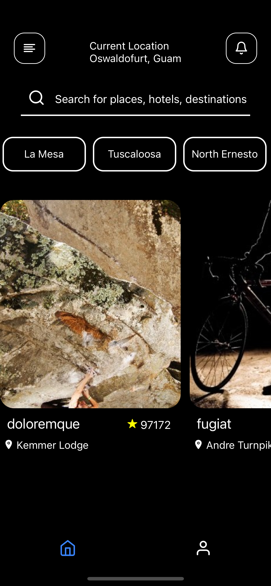
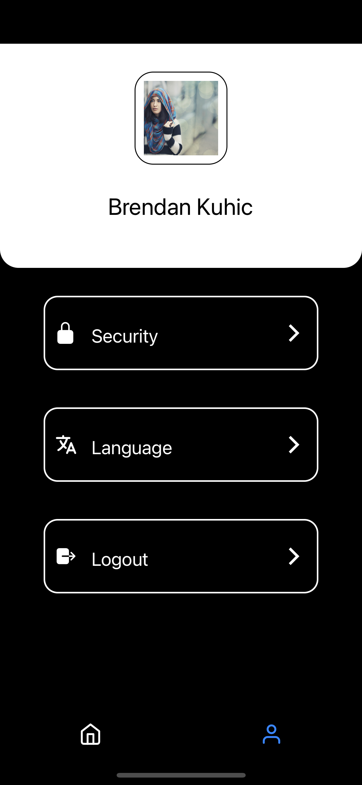
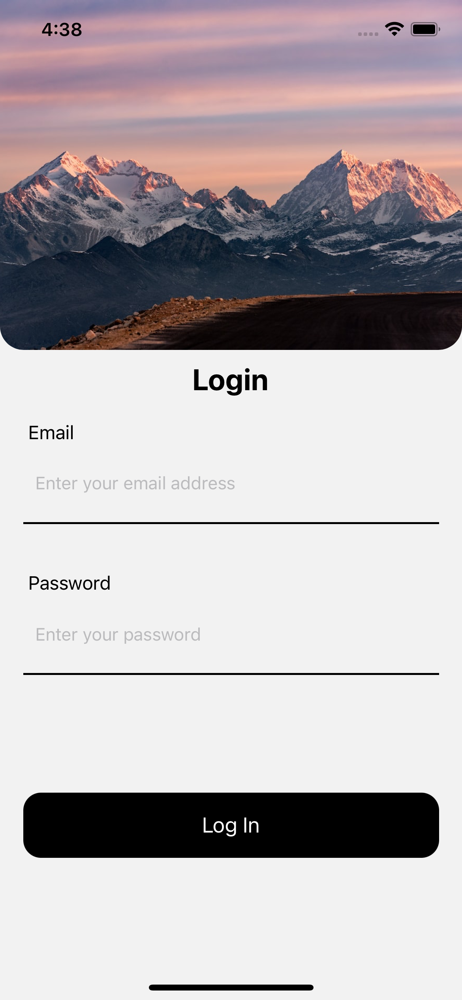

# Travel App

An app that recommmends popular tourist destinations to users based on their current location

### Technologies Used

<li>React Native</li>
<li>Redux Toolkit</li>
<li>Faker to mock API Calls </li>

### Setup

<h4>Clone the repository</h4>

Via HTTPS: git clone https://github.com/raymondyegon/place_app.git

Via SSH: git clone git@github.com:raymondyegon/place_app.git

### Steps

<li>iOS &amp; Android package installation: npm install / yarn add</li>
<li>Start server: npm start / yarn start</li>
<li>Run app: npx react-native run-android / npx react-native run-ios</li>
<li>Alternatively, you can start both the serever and the app up by: npm run android / npm run ios </li>

## Screenshots

